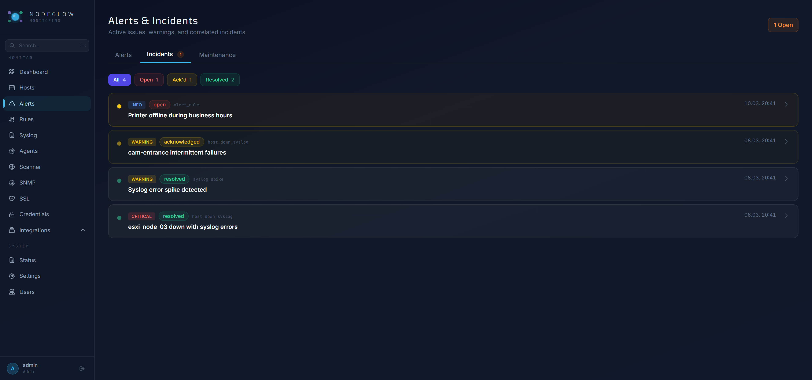
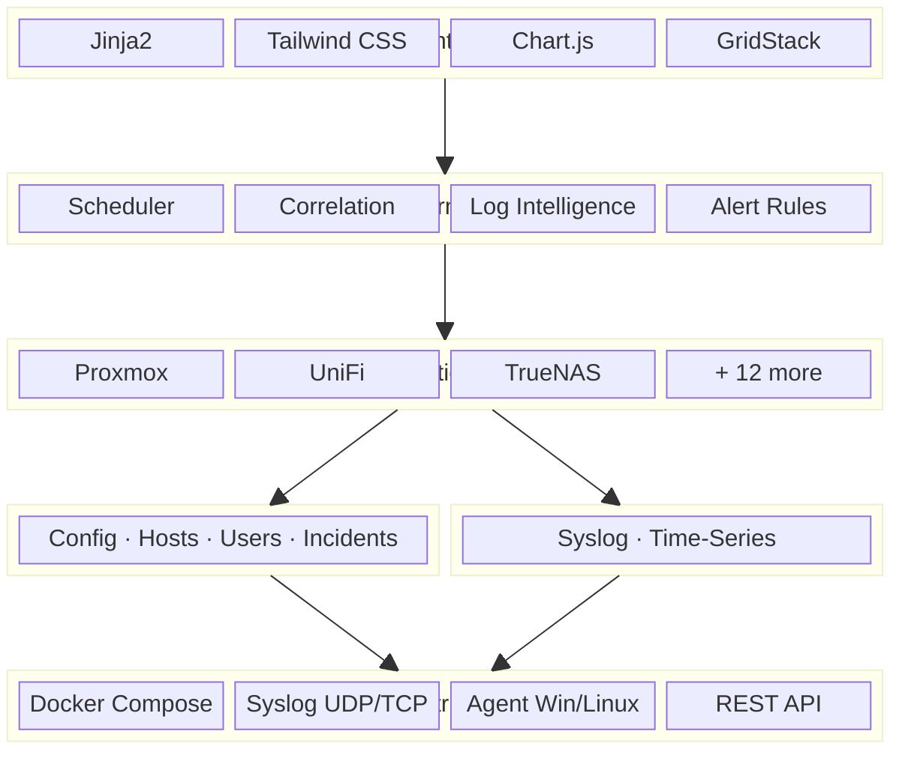

# Nodeglow

A self-hosted infrastructure monitoring platform with **log intelligence**, **incident correlation**, and **15 integrations** — built for homelabs and small networks.

---

## Screenshots

| Dashboard | Hosts |
|---|---|
|  |  |

| Host Detail | Incidents |
|---|---|
|  |  |

---

## Tech Stack



| Layer | Technology | Purpose |
|---|---|---|
| **Web framework** | FastAPI + Uvicorn | Async HTTP server, REST API, SSE |
| **Templates** | Jinja2 + Tailwind CSS | Server-rendered HTML with SPA navigation |
| **Charts** | Chart.js | Latency sparklines, syslog rate charts, heatmaps |
| **Dashboard** | GridStack.js | Drag-and-drop widget layout |
| **Primary DB** | PostgreSQL 16 (asyncpg) | Config, hosts, users, incidents, templates |
| **Log DB** | ClickHouse | High-volume syslog storage, time-series queries |
| **ORM** | SQLAlchemy 2.0 (async) | Models, migrations (Alembic) |
| **Scheduler** | APScheduler | Periodic ping, integration polling, cleanup |
| **Encryption** | Fernet (SHA256) | Integration credentials at rest |
| **Notifications** | Telegram, Discord, Email | Alert delivery via configurable channels |
| **Agent** | Python (PyInstaller .exe) | Windows/Linux host agent with auto-update |

---

## Features

| Feature | Details |
|---|---|
| **Host monitoring** | ICMP Ping, HTTP/HTTPS, TCP — configurable per host |
| **30-day heatmap** | Visual uptime history per host |
| **SLA tracking** | Uptime % for 24h / 7d / 30d |
| **Health score** | Composite score (0–100%) from latency, uptime, CPU, RAM, disk, syslog errors |
| **Gravity well** | Animated particle visualization — healthy hosts orbit center, unhealthy drift outward |
| **Maintenance mode** | Pauses checks, hides host from alarms |
| **SSL expiry** | Badge + alert when certificate expires in <30 days |
| **Latency thresholds** | Per-host or global alarm when latency exceeds limit |
| **15 integrations** | Generic plugin system — see table below |
| **Syslog receiver** | UDP/TCP syslog (RFC 3164/5424) with auto-host assignment and full-text search |
| **Log intelligence** | Template extraction, auto-tagging (11 categories), noise scoring, burst detection |
| **Baseline anomalies** | Per-host hourly rate baselines with spike and silence detection |
| **Precursor detection** | Learns which log patterns precede host-down, integration failures, incidents |
| **Incident correlation** | Auto-detects related failures (multi-host down, syslog + ping, integration + host) |
| **Alert rules** | Custom triggers on any field — supports contains, regex, numeric operators |
| **Alerts page** | Offline hosts, integration errors, UPS on battery, SSL expiry, maintenance |
| **Anomaly detection** | Proxmox VM CPU/RAM spike detection (statistical + threshold) |
| **System status** | Self-monitoring page with CPU, RAM, disk, DB stats, scheduler, logs |
| **Agent system** | Auto-enrolling Windows/Linux agents with auto-update |
| **REST API** | Full API with key auth (readonly/editor/admin roles) |
| **Multi-user** | Admin / Editor / Read-only roles |
| **Notifications** | Telegram, Discord, Email (SMTP), Webhook |
| **Sparklines** | 2h latency sparklines in dashboard host cards |
| **SPA navigation** | Instant page transitions without full reload |
| **Data retention** | Configurable per integration type, automatic cleanup |

---

## Integrations

All integrations use a generic plugin system (`BaseIntegration` ABC). Adding a new integration = one Python file + one HTML template.

| Integration | What is monitored |
|---|---|
| **Proxmox** | Nodes, VMs, LXC containers — CPU, RAM, disk, IO rates |
| **UniFi** | APs, switches, clients, signal strength, port PoE |
| **UniFi NAS (UNAS)** | Storage, volumes, RAID |
| **Pi-hole** | Query stats, blocking %, top domains |
| **AdGuard Home** | Query stats, blocking %, filter lists |
| **Portainer** | Docker containers across all endpoints |
| **TrueNAS** | Pools, datasets, alerts, system info |
| **Synology DSM** | Volumes, shares, CPU, RAM, SMART |
| **pfSense / OPNsense** | Interface stats, rules, DHCP leases |
| **Home Assistant** | Entity states, system info |
| **Gitea** | Repos, users, issues, system stats |
| **phpIPAM** | IP subnets, address utilisation, auto-import to Hosts |
| **Speedtest** | Download, upload, latency — scheduled via `speedtest-cli` |
| **UPS / NUT** | Battery charge, status (on-line / on-battery), runtime |
| **Redfish / iDRAC** | Server hardware temps, fans, power, system info |

---

## Quick start

### Requirements

- Docker & Docker Compose
- Linux host (for ICMP ping via `NET_RAW` capability)

### Run

```bash
git clone https://github.com/jubacCH/Nodeglow.git nodeglow
cd nodeglow
docker compose up -d
```

Open **http://localhost:8000** — the setup wizard runs on first start.

> Data is stored in PostgreSQL (managed by Docker Compose). The `./data/` volume holds the encryption key.

---

## Configuration

All settings are available at **`/settings`**:

| Setting | Default | Description |
|---|---|---|
| Site name | NODEGLOW | Shown in page title and sidebar |
| Timezone | UTC | Display timezone |
| Ping interval | 60 s | How often hosts are checked |
| Integration interval | 60 s | How often integrations are polled |
| Ping retention | 30 days | How long ping results are kept |
| Integration retention | 7 days | How long integration snapshots are kept |
| Latency threshold (global) | — | Alarm when latency exceeds this (ms) |
| CPU/RAM/Disk threshold | 85 / 85 / 90 % | Threshold for anomaly alerts |
| Anomaly multiplier | 2.0x | Alert when metric > Nx 24h avg |
| Syslog port | 1514 | UDP/TCP syslog listener port |

---

## Architecture

```
nodeglow/
├── backend/
│   ├── main.py                # FastAPI app, middleware, router registration
│   ├── config.py              # Environment config, secret key
│   ├── models/                # SQLAlchemy models
│   │   ├── base.py            # Engine, session factory, encryption helpers
│   │   ├── integration.py     # IntegrationConfig + Snapshot (generic)
│   │   ├── incident.py        # Incident + IncidentEvent
│   │   ├── alert_rule.py      # User-defined alert rules
│   │   └── log_template.py    # LogTemplate, HostBaseline, PrecursorPattern
│   ├── integrations/          # Plugin system (one file per integration)
│   │   ├── _base.py           # BaseIntegration ABC, ConfigField, CollectorResult
│   │   ├── __init__.py        # Auto-discovery + registry
│   │   └── ...                # 15 integration plugins
│   ├── services/              # Business logic layer
│   │   ├── snapshot.py        # Snapshot CRUD + batch queries
│   │   ├── integration.py     # Integration CRUD + encryption
│   │   ├── syslog.py          # UDP/TCP syslog server + parser + live tail (SSE)
│   │   ├── correlation.py     # Incident correlation engine (5 rules, auto-resolve)
│   │   ├── log_intelligence.py # Template extraction, tagging, baselines, precursors
│   │   ├── rules.py           # Alert rule evaluation engine
│   │   └── clickhouse_client.py # ClickHouse connection + query helpers
│   ├── routers/               # FastAPI routers (HTML + JSON)
│   ├── scheduler.py           # APScheduler (ping, integrations, SSL, cleanup, intelligence)
│   ├── notifications.py       # Telegram, Discord, Email, Webhook
│   ├── templates/             # Jinja2 templates
│   │   ├── base.html          # Layout, sidebar, SPA navigation
│   │   ├── widgets/           # Dashboard widget templates (GridStack)
│   │   └── integrations/      # Generic list/detail templates
│   └── static/                # CSS, JS, icons, agent binaries
├── docker-compose.yml         # App + PostgreSQL + ClickHouse
└── data/                      # Encryption key (Docker volume)
```

### Data flow

1. **Scheduler** (APScheduler, async) runs collector functions on configurable intervals.
2. Each collector stores a **snapshot** row in PostgreSQL (`data_json` column holds full JSON).
3. **Routers** read the latest snapshot on page load — no live API calls on every request.
4. **Syslog receiver** processes messages through the intelligence pipeline (template extraction, auto-tagging, burst detection) and batch-inserts into ClickHouse.
5. **Log intelligence** (30s interval) computes baselines, learns precursor patterns, and refreshes noise scores.
6. **Correlation engine** (60s interval) detects related failures and creates incidents.
7. **Alert rules** (60s interval) evaluate user-defined conditions and fire notifications/incidents.
8. Background **cleanup job** (daily at 03:00) prunes data older than configured retention.

---

## License

MIT
