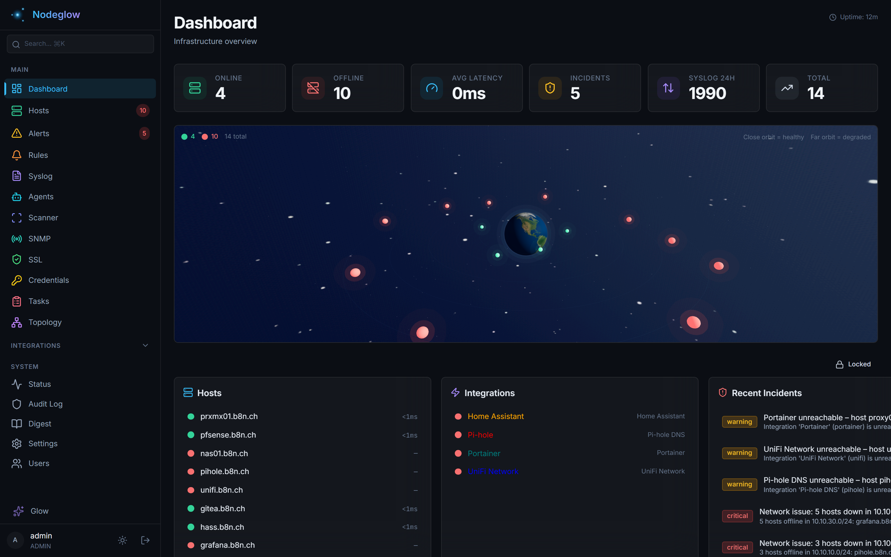
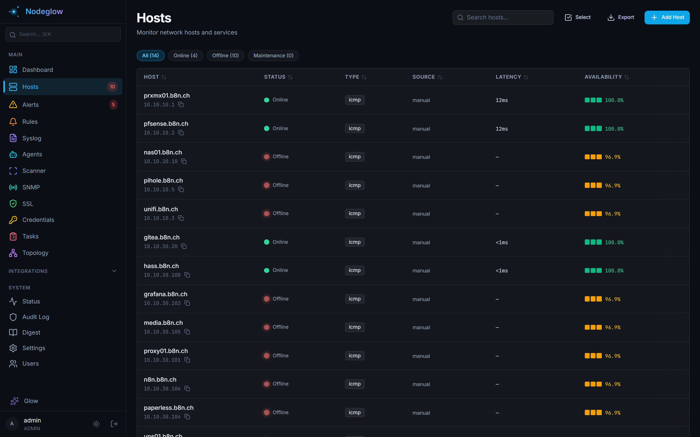
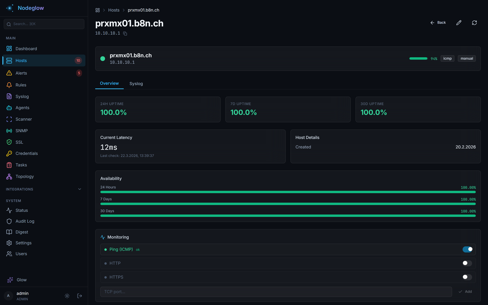
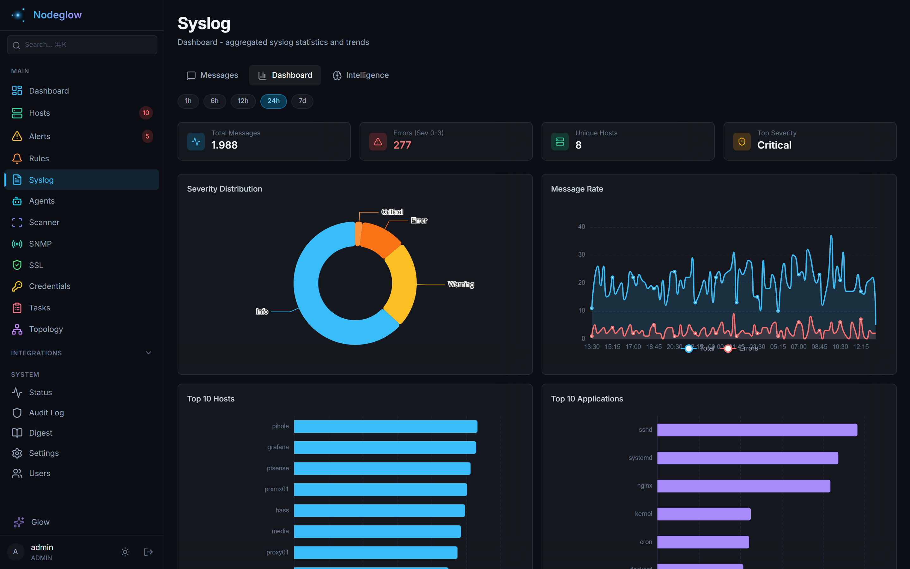
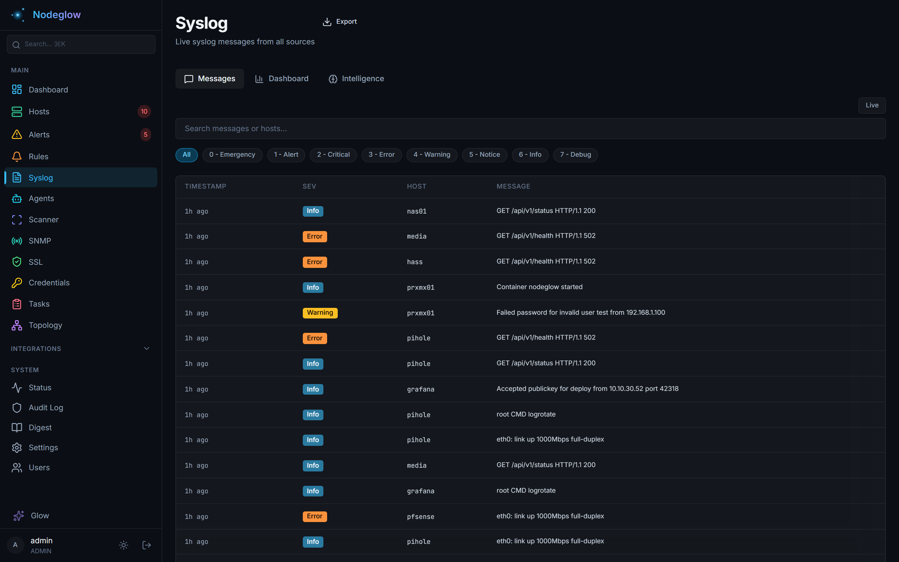
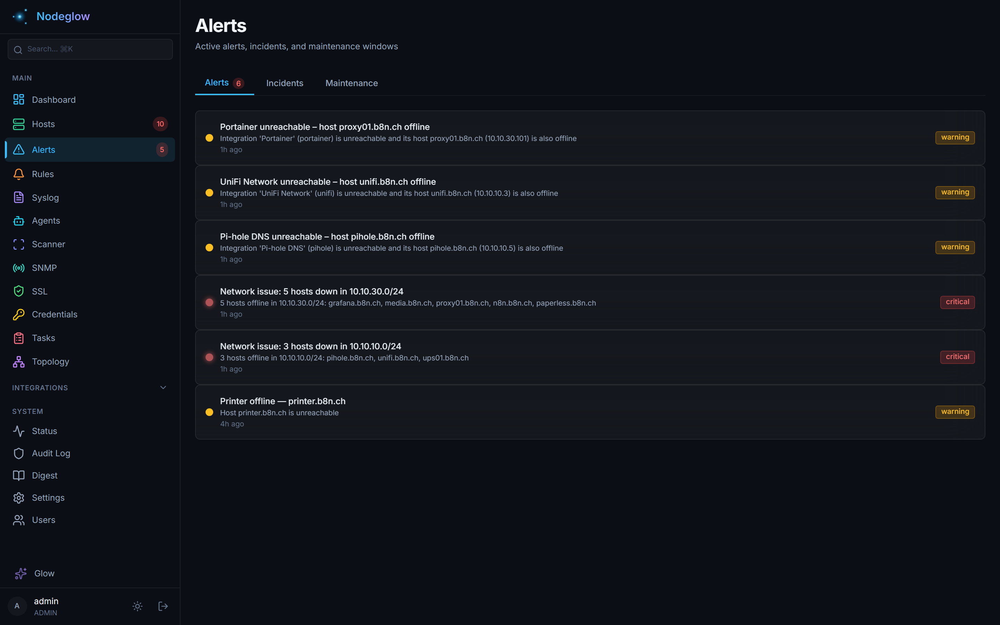

# Nodeglow

A self-hosted infrastructure monitoring platform with **log intelligence**, **incident correlation**, and **16 integrations** — built for homelabs and small networks.

---

## Screenshots

| Dashboard | Hosts |
|---|---|
|  |  |

| Host Detail | Syslog Dashboard |
|---|---|
|  |  |

| Syslog Messages | Alerts |
|---|---|
|  |  |

---

## Tech Stack

| Layer | Technology | Purpose |
|---|---|---|
| **Frontend** | Next.js 14 + React 18 | SPA with server-side rendering |
| **Styling** | Tailwind CSS | Utility-first CSS |
| **Charts** | ECharts 6 | Latency sparklines, syslog rate charts, heatmaps |
| **3D Visualization** | Three.js + React Three Fiber | Gravity well host visualization |
| **Dashboard** | React Grid Layout | Drag-and-drop widget layout |
| **State** | Zustand + TanStack Query | Client state + server data fetching |
| **Backend** | FastAPI + Uvicorn | Async HTTP server, REST API |
| **Primary DB** | PostgreSQL 16 (asyncpg) | Config, hosts, users, incidents, API keys |
| **Log DB** | ClickHouse 24.8 | High-volume syslog storage, time-series queries |
| **ORM** | SQLAlchemy 2.0 (async) | Models, migrations (Alembic) |
| **Scheduler** | APScheduler | Periodic ping, integration polling, cleanup |
| **Encryption** | Fernet (SHA256) | Integration credentials at rest |
| **Notifications** | Telegram, Discord, Email, Webhook | Alert delivery via configurable channels |
| **Agent** | Rust (Tokio + reqwest) | Windows/Linux host agent with auto-update |

---

## Features

| Feature | Details |
|---|---|
| **Host monitoring** | ICMP Ping, HTTP/HTTPS, TCP — configurable per host |
| **30-day heatmap** | Visual uptime history per host |
| **SLA tracking** | Uptime % for 24h / 7d / 30d |
| **Health score** | Composite score (0–100%) from latency, uptime, CPU, RAM, disk, syslog errors |
| **Gravity well** | Animated 3D particle visualization — healthy hosts orbit center, unhealthy drift outward |
| **Maintenance mode** | Pauses checks, hides host from alarms |
| **SSL monitoring** | Certificate expiry tracking with alerts, auto-discovery via port scanner |
| **Latency thresholds** | Per-host or global alarm when latency exceeds limit |
| **16 integrations** | Generic plugin system — see table below |
| **Syslog receiver** | UDP/TCP syslog (RFC 3164/5424) with auto-host assignment, full-text search, host allowlist |
| **Log intelligence** | Template extraction, auto-tagging (11 categories), noise scoring, burst detection |
| **Baseline anomalies** | Per-host hourly rate baselines with spike and silence detection |
| **Precursor detection** | Learns which log patterns precede host-down, integration failures, incidents |
| **Incident correlation** | Auto-detects related failures (multi-host down, syslog + ping, integration + host) |
| **Alert rules** | Custom triggers on any field — supports contains, regex, numeric operators |
| **Subnet scanner** | Port discovery with service identification and SSL certificate detection |
| **SNMP monitoring** | MIB uploads, OID polling, configurable thresholds |
| **Anomaly detection** | Proxmox VM CPU/RAM spike detection (statistical + threshold) |
| **System status** | Self-monitoring page with CPU, RAM, disk, DB stats, scheduler, logs |
| **Agent system** | Rust-based Windows/Linux agents with auto-enrollment and auto-update |
| **REST API** | Full API with key auth (`X-API-Key`, readonly/editor/admin roles) |
| **Multi-user** | Admin / Editor / Read-only roles |
| **Notifications** | Telegram, Discord, Email (SMTP), Webhook |
| **Tasks** | Aggregated pending admin work (new ports, SSL certs) |
| **Weekly digest** | Scheduled email summary — incidents, host availability, syslog stats, SSL expiry |
| **Data retention** | Configurable per integration type, automatic cleanup |

---

## Integrations

All integrations use a generic plugin system (`BaseIntegration` ABC). Adding a new integration = one Python file.

| Integration | What is monitored |
|---|---|
| **Proxmox** | Nodes, VMs, LXC containers — CPU, RAM, disk, IO rates |
| **UniFi** | APs, switches, clients, signal strength, port PoE |
| **UniFi NAS** | Storage, volumes, RAID |
| **Pi-hole** | Query stats, blocking %, top domains |
| **AdGuard Home** | Query stats, blocking %, filter lists |
| **Portainer** | Docker containers across all endpoints |
| **TrueNAS** | Pools, datasets, alerts, system info |
| **Synology DSM** | Volumes, shares, CPU, RAM, SMART |
| **pfSense / OPNsense** | Interface stats, rules, DHCP leases |
| **Home Assistant** | Entity states, system info |
| **Gitea** | Repos, users, issues, system stats |
| **phpIPAM** | IP subnets, address utilisation, auto-import to Hosts |
| **Speedtest** | Download, upload, latency — scheduled via `speedtest-cli` |
| **UPS / NUT** | Battery charge, status (on-line / on-battery), runtime |
| **Redfish / iDRAC** | Server hardware temps, fans, power, system info |
| **Swisscom Internet-Box** | WAN status, connected devices, device info (Arcadyan IB5) |

---

## Quick start

### Requirements

- Docker & Docker Compose
- Linux host (for ICMP ping via `NET_RAW` capability)

### Run

```bash
git clone https://github.com/jubacCH/Nodeglow.git nodeglow
cd nodeglow
docker compose up -d
```

Open **http://localhost:8000** — the setup wizard runs on first start.

> Data is stored in PostgreSQL + ClickHouse (managed by Docker Compose). The `./data/` volume holds the encryption key.

---

## Agent

Nodeglow includes a lightweight Rust agent for Windows and Linux that collects system metrics and logs.

### Install

**Windows** (PowerShell as Admin):
```powershell
irm http://YOUR_SERVER:8000/install/windows | iex
```

**Linux**:
```bash
curl -fsSL http://YOUR_SERVER:8000/install/linux | sudo bash
```

### What the agent collects

- CPU, memory, swap, disk usage (per mount)
- Network interfaces (RX/TX bytes)
- Top processes by CPU
- OS info, CPU info, uptime
- Docker containers (if available)
- CPU temperature (if available)
- Windows Event Logs / Linux journal logs

### How it works

1. Agent enrolls with the server using a shared enrollment key
2. Reports metrics every 30s (configurable)
3. Auto-creates a host entry in Nodeglow on enrollment
4. Checks for updates every 5 minutes (SHA256 hash comparison)
5. Receives remote commands (e.g. uninstall) from the server

---

## Configuration

All settings are available at **Settings** (admin only):

| Setting | Default | Description |
|---|---|---|
| Site name | NODEGLOW | Shown in page title and sidebar |
| Timezone | UTC | Display timezone |
| Ping interval | 60 s | How often hosts are checked |
| Integration interval | 60 s | How often integrations are polled |
| Ping retention | 30 days | How long ping results are kept |
| Integration retention | 7 days | How long integration snapshots are kept |
| Latency threshold (global) | — | Alarm when latency exceeds this (ms) |
| CPU/RAM/Disk threshold | 85 / 85 / 90 % | Threshold for anomaly alerts |
| Anomaly multiplier | 2.0x | Alert when metric > Nx 24h avg |
| Syslog port | 1514 | UDP/TCP syslog listener port |
| Syslog host allowlist | Off | Only accept syslog from IPs in the Hosts list |
| Weekly digest | Off | Scheduled email summary (day + hour configurable) |

---

## Architecture

```
nodeglow/
├── frontend/                # Next.js 14 SPA
│   └── src/
│       ├── app/             # Pages (dashboard, hosts, alerts, syslog, ...)
│       ├── components/      # Reusable UI components
│       ├── hooks/           # React Query hooks
│       └── stores/          # Zustand state stores
├── backend/
│   ├── main.py              # FastAPI app, middleware, router registration
│   ├── models/              # SQLAlchemy models (PostgreSQL)
│   ├── integrations/        # Plugin system (one file per integration)
│   │   ├── _base.py         # BaseIntegration ABC
│   │   └── ...              # 16 integration plugins
│   ├── services/            # Business logic
│   │   ├── syslog.py        # UDP/TCP syslog receiver + parser
│   │   ├── correlation.py   # Incident correlation engine
│   │   ├── log_intelligence.py  # Template extraction, tagging, baselines
│   │   ├── port_discovery.py    # Subnet scanner + SSL detection
│   │   └── snmp.py          # SNMP polling + MIB parsing
│   ├── routers/             # FastAPI routers (JSON API)
│   ├── scheduler.py         # APScheduler background jobs
│   └── static/              # Agent binaries for auto-update
├── agent/                   # Rust agent (Windows + Linux)
│   ├── src/
│   │   ├── main.rs          # Entry point + main loop
│   │   ├── collector.rs     # Unified metrics schema
│   │   ├── collector_linux.rs   # Linux metrics (/proc, /sys)
│   │   ├── collector_windows.rs # Windows metrics (sysinfo crate)
│   │   ├── client.rs        # HTTP client (enroll, report, update)
│   │   └── updater.rs       # Auto-update logic
│   └── Cargo.toml
├── docker-compose.yml       # PostgreSQL + ClickHouse + Backend + Frontend
└── data/                    # Encryption key (Docker volume)
```

### Data flow

1. **Scheduler** (APScheduler, async) runs collector functions on configurable intervals.
2. Each collector stores a **snapshot** row in PostgreSQL (`data_json` column holds full JSON).
3. **Frontend** (Next.js) fetches data via REST API from the backend.
4. **Syslog receiver** processes messages through the intelligence pipeline (template extraction, auto-tagging, burst detection) and batch-inserts into ClickHouse.
5. **Log intelligence** (30s interval) computes baselines, learns precursor patterns, and refreshes noise scores.
6. **Correlation engine** (60s interval) detects related failures and creates incidents.
7. **Alert rules** (60s interval) evaluate user-defined conditions and fire notifications/incidents.
8. **Agents** report metrics and logs every 30s, auto-update when new binaries are available.
9. Background **cleanup job** (daily at 03:00) prunes data older than configured retention.

---

## License

MIT
